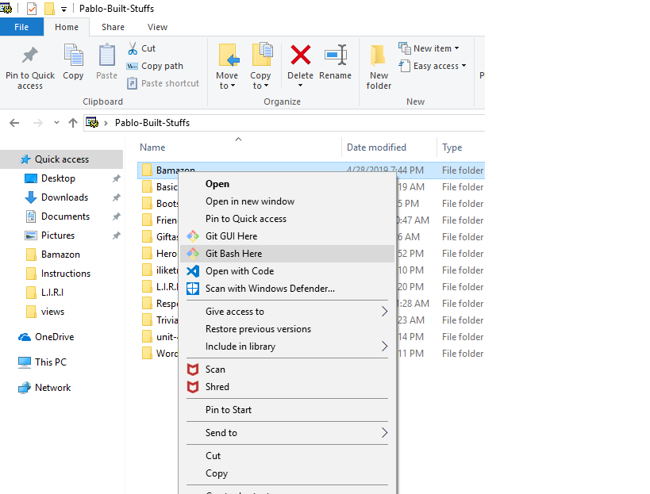
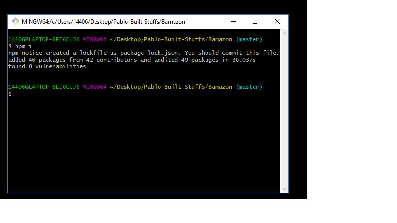
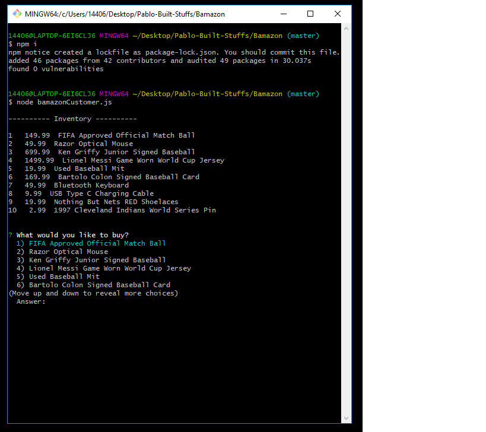
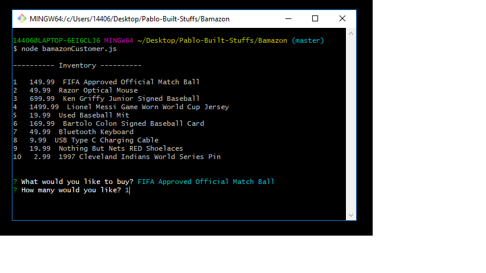
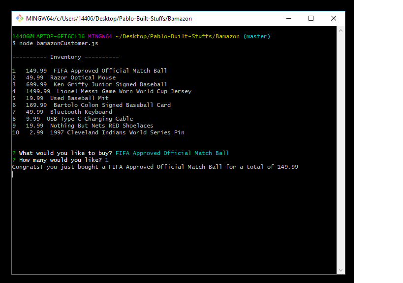
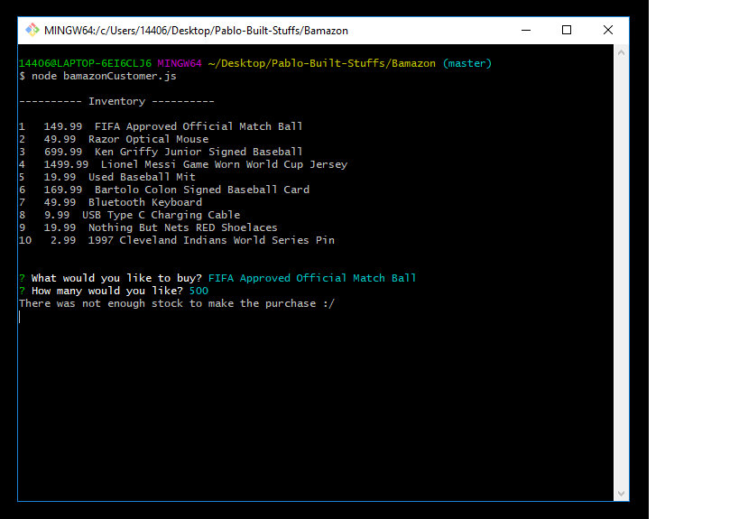

# Bamazon Overview
Bamazon is a storefront application utilizing Node.js and MySQL. Users will be displayed the inventory and asked what they would like to buy and the amount of that product. If there is sufficient inventory of that product, then the purchase will go through, if not, the user will be sent back to the inventory list.

## Setup
This application requires some setup before operation. You will need to have Node.js installed on your computer as well as some type of Command Line Interface (CLI). Once you have Node and a CLI, navigate to the root folder of your application in the CLI and run npm i. This will install the necessary packages, MySQL and Inquirer, found in the package.json file. Once completed, you are all geared up and ready to use the Bamazon App!

### Startup and Use
Once you have the setup out of the way you are on your way to making purchases through Bamazon! The next step would be navigating to the root folder in your CLI and running following command to start the application.

You now have a list of all the items available on the Bamazon Marketplace and can scroll through your choices using the arrow keys. Once your selection is made you will be asked how much of that specific product you would like to purchase.

After you have entered the amount of that item you wish to purchase, the app will check the inventory to make sure enough of the specified product is available, if so, you will receive a message like this

and if you asked for more of an item than there is stock, the transaction will not go through and you will receive a message like this

regardless of whether your purchase was made you will be presented the inventory again, allowing you to make more purchases!
